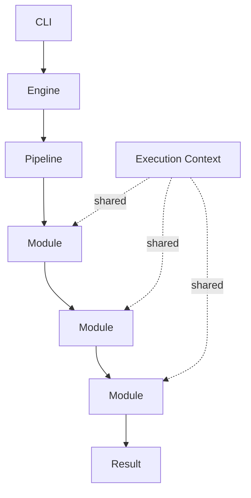

# Tauron Architecture

## Overview

Tauron is designed as a **lightweight, modular cryptographic framework** focused on performance, streaming support and extensibility.

The project consists of a single executable that exposes a command-line interface (CLI). No graphical user interface is planned.

Internally, Tauron is built around a **processing pipeline**. Data is passed through a series of **independent modules** that operate on a **shared execution context**. Each module has a single responsibility and can **transform the internal state** before passing control to the next stage.

The **cryptographic algorithm** itself is intentionally **separated from the engine**. The engine provides the infrastructure, while cryptographic behavior is implemented through modules.

## Design Goals

- Cross-platform
- Single executable
- Command-line interface
- High performance
- Low memory overhead
- Streaming support
- Modular architecture
- Strong separation of responsibilities
- Configurable cryptographic pipeline
- Future-proof and easy to extend

## High-Level Architecture

## Components

### CLI

The command-line interface is the only public entry point.

Responsibilities:

- Parse command-line arguments
- Load configuration
- Open files or streams
- Initialize the engine
- Execute the requested operation
- Report progress and errors

The CLI should remain thin and contain no cryptographic logic.
