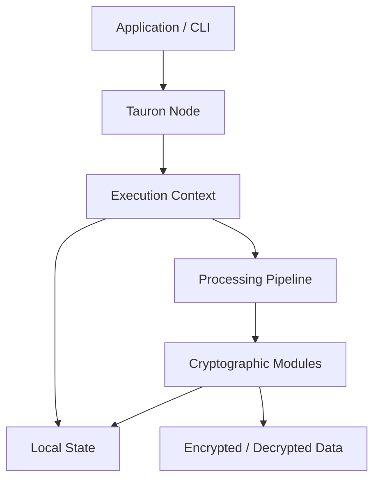
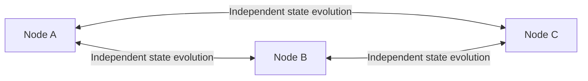
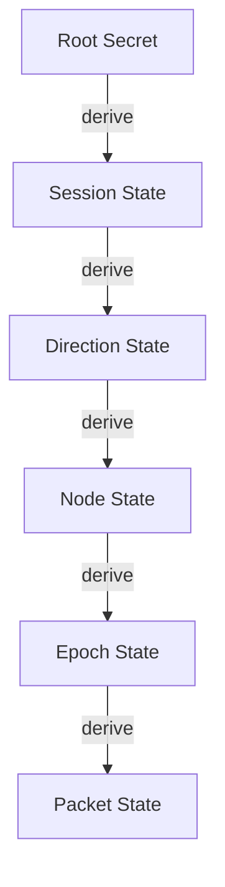
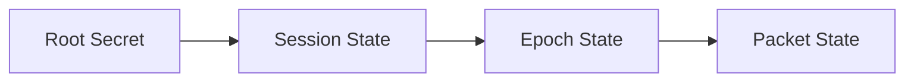
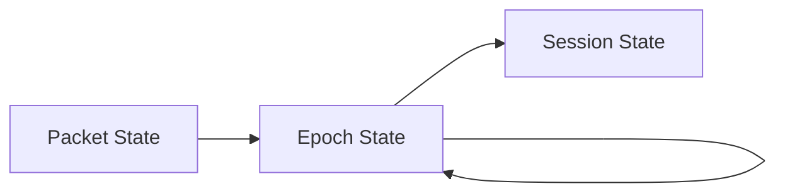
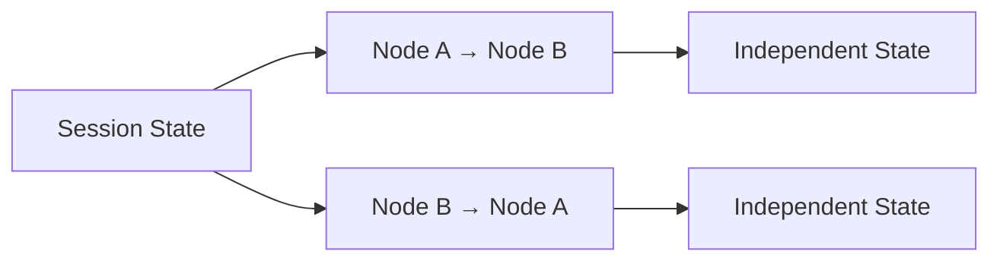
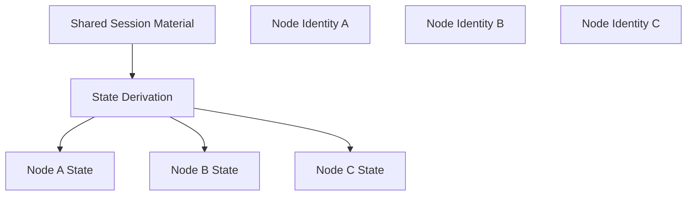
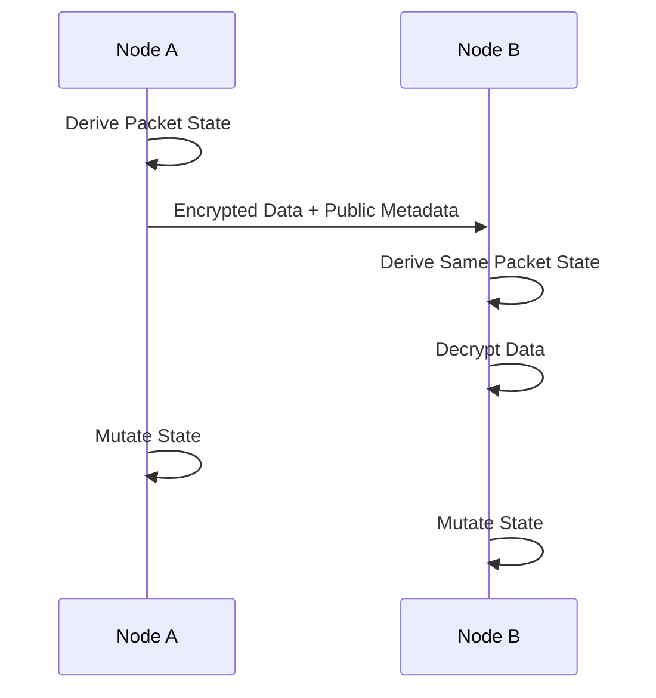
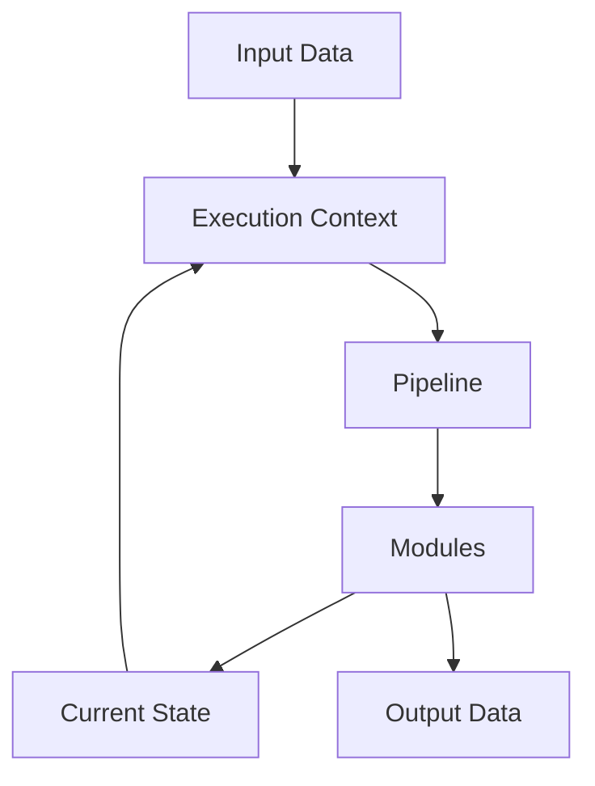

# Tauron Architecture

## Overview

Tauron is a **lightweight, modular cryptographic engine** designed around deterministic state evolution.

The project consists of a single executable that exposes a command-line interface (CLI). No graphical user interface is planned.

Internally, Tauron is built around a **processing pipeline**. Data is passed through a series of **independent modules** that operate on a **shared execution context**. Each module has a single responsibility and can transform the internal state before passing control to the next stage.

The c**ryptographic algorithm** itself is intentionally **separated from the engine**. The engine provides the infrastructure, while cryptographic behavior is implemented through modules.

Instead of transferring cryptographic state between participants, Tauron derives states independently on every participating node.

The system separates:

- Communication state management
- Cryptographic processing
- Pipeline execution
- Data transformation

A Tauron instance **does not distinguish between sender and receiver**. Every participant is a node capable of both encryption and decryption.

## Design Goals

- Cross-platform
- Single executable
- Command-line interface
- High performance
- Low memory overhead
- Streaming support
- Modular architecture
- Strong separation of responsibilities
- Configurable cryptographic pipeline
- Future-proof and easy to extend

## High-Level Architecture

## Node-Based Communication Model

Tauron uses a node-based model instead of a sender/receiver model.

Every participant owns an independent Tauron instance.

Nodes never exchange internal states.

Each node derives required states independently.

## State Hierarchy

Tauron uses multiple layers of state.

Each layer is derived from the previous layer.

**Lower layers must never be able to reconstruct higher layers.**

## Information Flow Rules

Allowed:

Forbidden:

A compromised lower-level state must not expose higher-level secrets.

## Direction Separation

Communication directions use independent states.

Example:

The state used for outgoing communication is never reused for incoming communication.

## Participant-Specific Derivation

Multiple nodes can participate in the same communication environment.

Each node receives a unique derived state.

Compromise of one node does not automatically compromise other nodes.

## State Evolution

States are not transferred.

They evolve locally and deterministically.

## Packet Structure

Packets contain only information required for synchronization and processing.

No secret state material is transmitted.

|      Packet         |
|:-------------------:|
|    Public Header    |
|  Encrypted Payload  |
| Authentication Data |

Possible public metadata:

- Version
- Counter
- Epoch identifier
- Algorithm profile
- Flags

## Core Engine Flow

