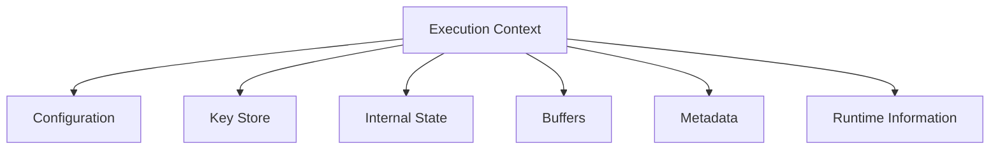
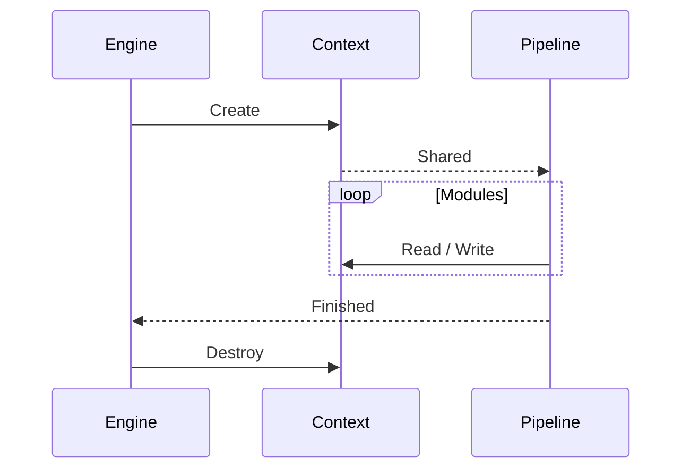

# Tauron Execution Context

## Overview

The execution context is the **central data structure** of Tauron.

It represents the **complete state of a single encryption or decryption operation** and is shared across all modules within the processing pipeline.

Rather than communicating directly, **modules exchange information** exclusively **through the execution context**.

A context exists only for the lifetime of a single operation.

## Design Goals

The execution context should be:

- Lightweight
- Cache-friendly
- Deterministic
- Easy to inspect during debugging
- Independent of individual cryptographic modules
- Reusable for both block and streaming operations

## High-Level Structure

## Components

### Configuration

Configuration contains all user-defined settings for the current operation.

Examples:

- Encryption mode
- Key size
- Security level
- Streaming mode
- Buffer size
- Enabled modules
- Module-specific settings

Configuration is considered read-only after initialization.

### Key Store

The key store contains every key required during execution.

Initially this may include:

- User key
- Derived working keys
- Session-specific keys
- Temporary module keys

The exact key hierarchy is intentionally left undefined and will evolve alongside the algorithm.

Modules may derive additional keys but should never modify the original user key.

### Internal State

The internal state represents the evolving cryptographic state of the engine.

Unlike keys, the state is expected to change continuously during execution.

Possible future contents include:

- Internal words
- Counters
- Entropy pool
- Mutation variables
- Synchronization values
- Round information

The state is the primary working area of the algorithm.

### Buffers

Buffers store the data currently processed by the engine.

Typical buffers include:

- Input buffer
- Output buffer
- Temporary working buffer

Streaming implementations may reuse the same buffers throughout execution to minimize memory allocations.

### Metadata

Metadata contains non-cryptographic information about the current operation.

Examples:

- Input size
- Output size
- Processing mode
- File information
- User-defined metadata
- Format version

Metadata should never influence cryptographic security unless explicitly defined by the algorithm.

### Runtime Information

Runtime information is used by the engine itself.

Examples:

- Current pipeline stage
- Module index
- Block counter
- Stream position
- Timing information
- Debug flags

These values primarily support execution and diagnostics.

## Lifetime

Each execution creates exactly one context.

Contexts are never shared between independent operations.

## Ownership

The engine owns the execution context.

Modules receive a reference to the context during execution.

No module should take ownership of the context or extend its lifetime.
