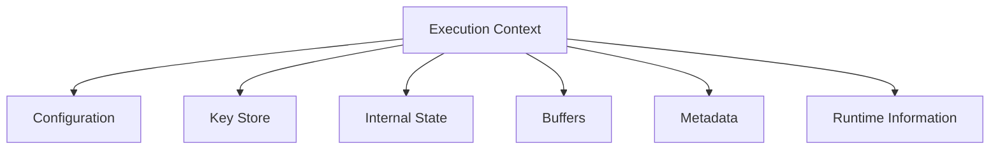

# Tauron Execution Context

## Overview

The execution context is the **central data structure** of Tauron.

It represents the **complete state of a single encryption or decryption operation** and is shared across all modules within the processing pipeline.

Rather than communicating directly, **modules exchange information** exclusively **through the execution context**.

A context exists only for the lifetime of a single operation.

## Design Goals

The execution context should be:

- Lightweight
- Cache-friendly
- Deterministic
- Easy to inspect during debugging
- Independent of individual cryptographic modules
- Reusable for both block and streaming operations

## High-Level Structure

## Configuration

Configuration contains all user-defined settings for the current operation.

Examples:

- Encryption mode
- Key size
- Security level
- Streaming mode
- Buffer size
- Enabled modules
- Module-specific settings

Configuration is considered read-only after initialization.
