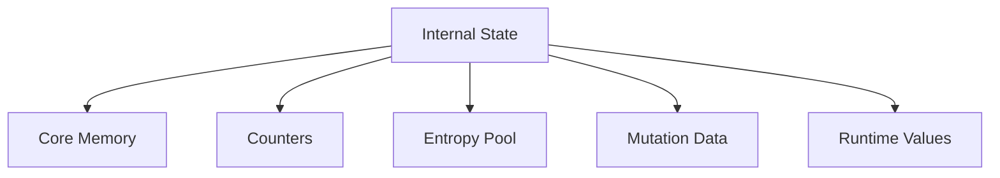
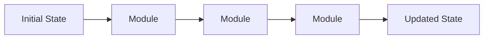

# Tauron Internal State

## Overview

The internal state is the **core working memory** of the Tauron engine.

Unlike cryptographic keys, which remain largely constant throughout an operation, the state is designed to **evolve continuously while data is processed**.

Every **module may observe or modify the state** according to its responsibility.

The state is expected to become the **primary source of diffusion, mutation and unpredictability** throughout the cryptographic pipeline.

## Design Goals

The state should be:

- Dynamic
- Deterministic
- Efficient
- Mutation-friendly
- Suitable for both block and streaming operations
- Independent of specific algorithms

## High-Level Structure

## Components

### Core Memory

The core memory represents the primary cryptographic working area.

It contains the mutable data manipulated by cryptographic modules.

Its exact size is intentionally configurable and may depend on:

- Security profile
- Key size
- Selected algorithm
- User configuration

Modules should treat the core memory as the primary source for transformations.

### Counters

Counters provide deterministic progression throughout execution.

Possible examples include:

- Block counter
- Stream position
- Round counter
- Mutation counter
- Internal iteration counter

Counters allow identical input and keys to produce deterministic execution while ensuring the state evolves continuously.

### Entropy Pool

The entropy pool stores values used to increase internal diversity.

Possible future sources include:

- Derived key material
- Previous state values
- Internal mixing operations
- Timing-independent deterministic generators

The entropy pool is never intended to rely on external randomness during normal execution.

### Mutation Data

Mutation data controls how the state evolves over time.

Rather than following a completely static execution path, future modules may use these values to influence:

- Transformation order
- Rotation values
- Mixing patterns
- Internal scheduling
- Module behavior

Mutation must always remain deterministic.

Identical input and configuration must produce identical output.

### Runtime Values

Runtime values contain temporary execution data.

Examples include:

- Active module index
- Current processing phase
- Temporary intermediate values
- Synchronization markers

These values support execution but are not considered long-term cryptographic state.

## State Evolution

Every module contributes to the evolution of the state.

No module should assume that the state remains unchanged after another module has executed.

## Lifetime

The state is created during engine initialization.

It exists for the duration of exactly one encryption or decryption operation.

Once execution completes, the state should be securely cleared before being released.

No state information should survive between independent operations unless explicitly defined by the engine.

## Design Principles

### Stateful Processing

The algorithm is intentionally state-driven.

Every processed block or stream segment contributes to the evolution of the internal state.

### Deterministic Mutation

State evolution must remain completely deterministic.

No hidden randomness should influence execution.

### Algorithm Independence

The engine defines the existence of the state.

The algorithm defines how the state changes.

### Continuous Evolution

The state should never become static during long-running operations.

Even when processing repetitive input, internal state evolution should continue.

### Efficient Memory Layout

The state should remain compact and cache-friendly.

Avoid unnecessary allocations or fragmented memory structures.

## Future Extensions

Future versions may extend the state with additional components, including:

- Integrity tracking
- Authentication data
- Adaptive scheduling information
- Parallel processing metadata
- Hardware-specific optimizations

Such extensions should preserve the existing architectural principles without changing the external engine design.
