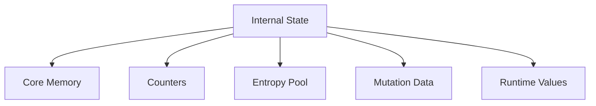

# Tauron Internal State

## Overview

The internal state is the **core working memory** of the Tauron engine.

Unlike cryptographic keys, which remain largely constant throughout an operation, the state is designed to **evolve continuously while data is processed**.

Every **module may observe or modify the state** according to its responsibility.

The state is expected to become the **primary source of diffusion, mutation and unpredictability** throughout the cryptographic pipeline.

## Design Goals

The state should be:

- Dynamic
- Deterministic
- Efficient
- Mutation-friendly
- Suitable for both block and streaming operations
- Independent of specific algorithms

## High-Level Structure

## Components

### Core Memory

The core memory represents the primary cryptographic working area.

It contains the mutable data manipulated by cryptographic modules.

Its exact size is intentionally configurable and may depend on:

- Security profile
- Key size
- Selected algorithm
- User configuration

Modules should treat the core memory as the primary source for transformations.
