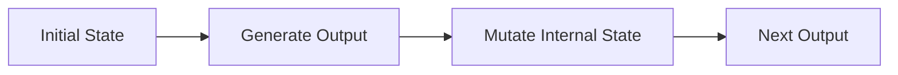

# Design

Experimental research framework for high-performance, configurable stream encryption in modern C++.

## Vision

Tauron is an experimental cryptography project focused on exploring modern stream encryption concepts, modular architecture and high-performance software design.

The goal is not to replace established cryptographic standards, but to serve as a research platform for experimenting with new ideas, evaluating different approaches and learning more about modern cryptography.

## Design Goals

Tauron is designed around a few core principles:

- Platform independent (C++20)
- Modular architecture
- High performance with minimal memory overhead
- Support for both fixed-size blocks and continuous data streams
- Configurable security and performance profiles
- Low runtime overhead
- Clean and maintainable implementation
- Extensible and experiment-friendly design

## Core Concept

Instead of relying on a single cryptographic mechanism, Tauron aims to combine multiple independent concepts into a layered architecture.

Possible components include:

- Key derivation
- State initialization
- Non-linear mixing
- Diffusion and permutation
- Keystream generation
- Dynamic state mutation

The project intentionally separates these components to allow experimentation with different implementations and combinations.

## Dynamic State Evolution

One of Tauron's primary research areas is the concept of a continuously evolving internal state.

Rather than producing encryption output from a static internal state, every processed block may transform the cipher state before generating the next output.

The intention is to make each stage of the encryption process dependent on the complete history of the stream rather than only on the original key material.
