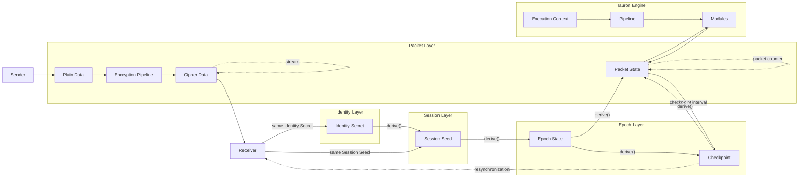

# Tauron – Conceptual State Architecture

```mermaid
flowchart LR

%% ===================================================================
%% PARTICIPANTS
%% ===================================================================

Sender["Sender"]
Receiver["Receiver"]

%% ===================================================================
%% LONG TERM
%% ===================================================================

subgraph Identity["Identity Layer"]
    IS["Identity Secret"]
end

%% ===================================================================
%% SESSION
%% ===================================================================

subgraph Session["Session Layer"]
    SS["Session Seed"]
end

%% ===================================================================
%% EPOCH
%% ===================================================================

subgraph Epoch["Epoch Layer"]
    ES["Epoch State"]
    CP["Checkpoint"]
end

%% ===================================================================
%% PACKET
%% ===================================================================

subgraph Packet["Packet Layer"]

    PS["Packet State"]

    ENC["Encryption Pipeline"]

    DATA["Plain Data"]

    CIPHER["Cipher Data"]

end

%% ===================================================================
%% ENGINE
%% ===================================================================

subgraph Engine["Tauron Engine"]

    CTX["Execution Context"]

    PIPE["Pipeline"]

    MOD["Modules"]

end

%% ===================================================================
%% FLOW
%% ===================================================================

Sender --> DATA

DATA --> ENC

ENC --> CIPHER

CIPHER --> Receiver

%% ===================================================================
%% STATE DERIVATION
%% ===================================================================

IS -->|"derive()"| SS

SS -->|"derive()"| ES

ES -->|"derive()"| PS

%% ===================================================================
%% ENGINE
%% ===================================================================

CTX --> PIPE

PIPE --> MOD

MOD --> PS

PS --> MOD

%% ===================================================================
%% STATE EVOLUTION
%% ===================================================================

PS -->|"mutate()"| PS

%% ===================================================================
%% CHECKPOINTS
%% ===================================================================

PS -->|"checkpoint interval"| CP

ES -->|"derive()"| CP

CP -->|"derive()"| PS

%% ===================================================================
%% RECEIVER
%% ===================================================================

Receiver -->|"same Identity Secret"| IS

Receiver -->|"same Session Seed"| SS

%% ===================================================================
%% STREAM
%% ===================================================================

CIPHER -. stream .-> CIPHER

PS -. packet counter .-> PS

CP -. resynchronization .-> Receiver
```
